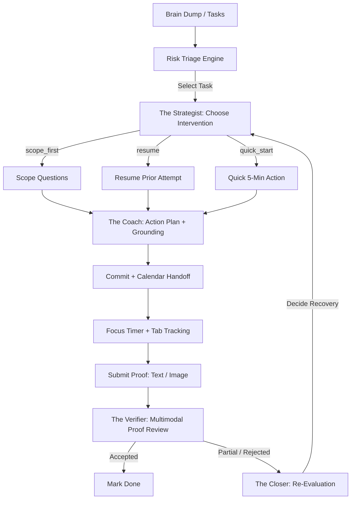

# CLUTCH

> ## You can't lie to CLUTCH.

The accountability companion that comes through when it matters. CLUTCH triages what you owe, unblocks what you avoid, verifies what you actually finished, and follows up when you don't. You can't just check a box to mark something done — you have to show the work, and CLUTCH checks it.

**▶ Live app:** https://clutch-529610052804.us-central1.run.app/

> **Vibe2Ship Hackathon Submission** · **Problem Statement 1: The Last-Minute Life Saver**
> Live on Google Cloud Run · Core model: Gemini 2.5 Flash via `@google/genai`

---

## Contents
- [Why CLUTCH](#why-clutch)
- [Adaptive Landing](#adaptive-landing--clutch-remembers-you)
- [Key Features](#key-features)
- [The Agents](#the-agents)
- [Agentic Depth & Architecture](#agentic-depth--architecture)
- [Getting Started](#getting-started)
- [Tech Stack & Credits](#tech-stack--credits)

---

## Why CLUTCH

People don't usually miss important deadlines because they forgot the task existed. They miss them because the task is vague, intimidating, or easy to procrastinate on when nobody is watching. Most productivity tools rely on **passive reminders** — notifications that are trivial to swipe away and do nothing to help you actually start or finish the work.

**CLUTCH** is a proactive AI accountability companion that moves past reminders into action. It triages your messy workload, diagnoses *why* you're avoiding a task, generates a friction-free starting point, and holds you to a **proof-based verification loop**. You cannot check a box to mark a task done — you show the work, and the AI verifies it.

For demo-grade reliability, CLUTCH runs a **hybrid architecture**: a deterministic product spine handles state transitions, navigation, and time-tracking, while a set of **named LLM agents** handle the reasoning — behavioral diagnosis, artifact generation, multimodal proof review, and proactive planning. The parts that must never fail in a live demo don't depend on a model.

---

## Adaptive Landing — CLUTCH remembers you

CLUTCH remembers you across sessions, and the landing page adapts to your state. **First-time visitors** get a guided demo flow that walks through the full accountability loop. **Returning visitors** skip the demo entirely and land on their live risk snapshot — highest-risk task, outstanding proofs, follow-through rate — and pick up exactly where they left off. State persists client-side, so there's no login and nothing to set up.

---

## Key Features

Each reasoning feature is driven by a named agent (see [The Agents](#the-agents)). The deterministic spine — triage scoring, the timer, tab-tracking, and the calendar handoff — stays rule-based on purpose.

### 1. Proactive Morning Briefing — *The Briefer*
A time-aware morning digest. Before you look at your tasks, **The Briefer** analyzes your active workload, outstanding proofs, and historical follow-through rate to write a candid greeting, highlight your single highest-risk item, and deliver a concrete starting nudge.
- **Google Tech:** Gemini 2.5 Flash text generation. · **UI:** `Morning Briefing` tab.

### 2. Messy Brain-Dump Parser — *The Scribe*
Write your mind in plain language (*"submit the slides by tomorrow night, also call the dentist, finish the cloud run deployment before 2pm"*). **The Scribe** structures the stream into distinct tasks with inferred deadlines, category tags, and effort estimates.
- **Google Tech:** Structured JSON output (`responseMimeType: 'application/json'` + `responseSchema`). · **UI:** `Brain Dump` inbox.

### 3. Smart Risk Triage Dashboard
Tasks are ranked by a deterministic triage engine — intentionally *not* an agent, so the core ranking never fails — using a real-time risk score:

```
Risk Score = Deadline Proximity × Effort Remaining × Avoidance Signals
```

Avoidance signals track how many times you've deferred a task or opened it and bailed.
- **UI:** `Dashboard` with live stats (Follow-Through %, Accepted Proofs, Off-Task Minutes, Rescued Tasks).

### 4. Autonomous Intervention Router — *The Strategist*
When you engage a task, **The Strategist** reads its behavioral history and selects the lowest-friction way in:
- `scope_first` — new or vague tasks: asks 2–4 highly specific, task-targeted questions.
- `resume` — tasks with prior progress or rejected proofs: skips scoping, resumes from the existing artifact and prior feedback.
- `quick_start` — heavily avoided tasks (3+ deferrals/bailouts): skips questions, generates a tiny action, suggests a 5-minute commitment to break the friction barrier.
- **Google Tech:** Gemini decision routing + behavioral memory; function calling (`prioritizeDay`).

### 5. Grounded Action Plans — *The Coach*
From your scoping answers or chosen path, **The Coach** generates a concrete starting artifact (an outline, a code template, a step-by-step plan). For research, study, or technical tasks it enables Google Search Grounding to attach real reference sources with clickable citations.
- **Google Tech:** Google Search Grounding (`tools: [{ googleSearch: {} }]`).

### 6. Focus Timer & Google Calendar Handoff
Once you agree to a plan, you commit to a duration. CLUTCH generates a pre-filled Google Calendar focus-block link so you can block your schedule in one click, then starts a countdown and monitors focus by tracking tab-visibility — counting off-task seconds and bailouts, and presenting an honest focus report at the end.
- **Google Tech:** Google Calendar template API.

### 7. Multimodal Proof Gate — *The Verifier*
To complete a commitment you must submit evidence — paste text, drop a link, or upload/drag-and-drop a screenshot. **The Verifier** reviews the proof against the original commitment and rules:
- `accepted` — proof matches; status updates.
- `partial` — progress made, core commitment incomplete.
- `rejected` — vague, unrelated, or prompt injection.
- **Google Tech:** Multimodal Gemini input (inline image data + text).

### 8. Post-Proof Re-Evaluation Loop — *The Closer*
If a proof is `partial` or `rejected`, **The Closer** doesn't drop you. It re-evaluates your updated state and behavioral signals and decides the next recovery move — a quick 5-minute retry, resuming the current artifact, or routing back to re-scoping to surface the blocker.
- **Google Tech:** Agentic re-evaluation loop.

---

## The Agents

CLUTCH's reasoning is handled by six named agents on top of a deterministic spine. Naming them keeps the agentic behavior legible instead of hiding it in a black box.

| Agent | Role | Powered by |
|-------|------|------------|
| **The Briefer** | Writes your candid, time-aware morning briefing and flags your single highest-risk item | Gemini 2.5 Flash (text) |
| **The Scribe** | Turns a messy brain-dump into structured tasks with deadlines, tags, and effort | Gemini structured JSON (`responseSchema`) |
| **The Strategist** | Reads behavioral history and chooses how you start: scope, resume, or quick-start | Gemini decision routing + behavioral memory; function calling |
| **The Coach** | Builds your concrete starting artifact and attaches real sources when the task needs them | Gemini + Google Search Grounding |
| **The Verifier** | Inspects submitted proof — text or screenshot — and rules accepted / partial / rejected | Multimodal Gemini (inline image + text) |
| **The Closer** | When proof falls short, decides the recovery move so you still finish | Agentic re-evaluation loop |

The **deterministic spine** — risk triage scoring, the focus timer, tab-tracking, and the calendar handoff — stays rule-based by design. The parts that must never break in a live demo don't depend on a model.

---

## Agentic Depth & Architecture

Rather than a black-box agent prone to looping or failing silently, CLUTCH exposes its reasoning through a **Visible Agent Audit Trail** — every major action shows the exact tools called and the step-by-step reasoning.



**Core agentic capabilities:**
1. **Autonomous decision-making** — The Strategist picks the intervention path and The Closer picks the recovery path, both from behavioral history.
2. **Function calling** — the `Day Plan` screen uses Gemini `functionDeclarations` to run a local tool (`prioritizeDay` with a time budget) and summarize the result.
3. **Grounding** — conditionally queries Google Search Grounding when a task needs factual, up-to-date references.
4. **Multimodal reasoning** — The Verifier visually inspects uploaded screenshots to confirm proof matches the commitment.
5. **Resilience & fallbacks** — every Gemini call is wrapped in `withGeminiResilience`: two automatic retries on transient errors, a 22-second timeout, and a fallback to local deterministic logic so the experience never hard-fails.

---

## Getting Started

```bash
# 1. Clone
git clone https://github.com/sarthak742/clutch.git
cd clutch

# 2. Install dependencies
npm install

# 3. Configure environment
cp .env.example .env.local
# then open .env.local and set your Gemini API key:
#   FOCUS_AGENT_GEMINI_KEY=your_key_here
# Get a key from Google AI Studio: https://aistudio.google.com/apikey

# 4. Run the dev server
npm run dev
```

Then open http://localhost:3000.

Other scripts: `npm run build` (production build) · `npm run start` (serve the production build).

---

## Tech Stack & Credits

**Core stack**
- **Framework:** Next.js (App Router, React 19)
- **Language:** TypeScript
- **Styling:** Tailwind CSS v4 + a custom CSS design system (CSS-only animations, fluid typography)
- **Motion:** Motion for React
- **Icons:** Phosphor Icons

**Google stack**
- **SDK:** `@google/genai` (`gemini-2.5-flash`)
- **APIs:** Google Calendar template API, Google Search Grounding
- **Deployment:** Google Cloud Run (multi-stage Docker build)

**Credits**
- Atmospheric animated backdrop inspired by the 21st.dev Silk animation.
- Design philosophy: clean, premium developer-tool aesthetic — dark palette, high-contrast typography, explicit micro-animations.

---

## Author

Built by [sarthak742](https://github.com/sarthak742) for the Vibe2Ship Hackathon.

## License

MIT — see [`LICENSE`](LICENSE).
