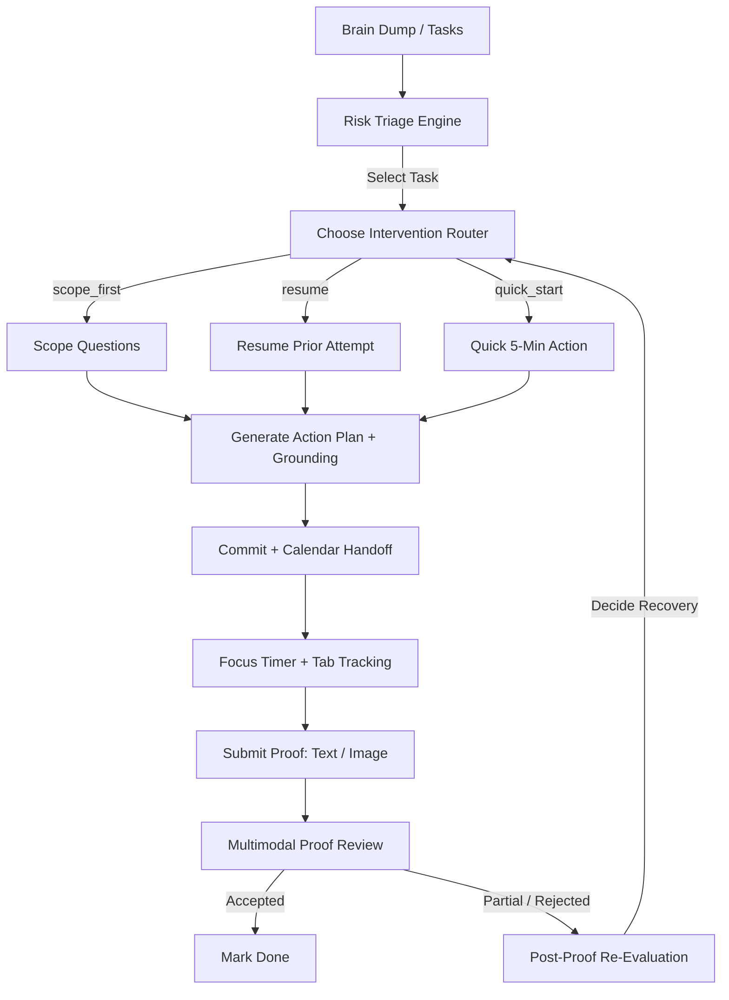

# CLUTCH — AI Accountability Companion

> **Vibe2Ship Hackathon Submission**  
> **Problem Statement 1:** The Last-Minute Life Saver  
> **Target Deployment:** Google Cloud Run  
> **Core Model:** Gemini 2.5 Flash via `@google/genai`  

---

## 💡 Solution Overview & Product Philosophy

People do not usually miss important deadlines because they forgot the task existed. They miss them because the task is vague, intimidating, or easy to procrastinate on when nobody is watching. Existing productivity tools rely on **passive reminders**—notifications that are trivial to swipe away and do nothing to help you actually start or finish the work.

**CLUTCH** is a proactive AI accountability companion that moves beyond reminders into meaningful action. It acts as an active partner: it triages your messy workload, diagnoses *why* you are avoiding specific tasks, generates tailored starting points to remove friction, and holds you to a **proof-based verification loop**. You cannot simply check a box to mark a task done; you must show the work, and the AI will verify it.

To ensure absolute reliability for live demos and production usage, CLUTCH uses a **hybrid architecture**: a deterministic product spine for state transitions, navigation, and time-tracking, combined with LLM reasoning for behavioral diagnosis, artifact generation, multimodal proof review, and proactive planning.

---

## 🛠️ Key Features

### 1. The Proactive Morning Briefing
Before you even look at your tasks, CLUTCH generates a time-aware morning digest. Using Gemini, it analyzes your active workload, outstanding proofs, and historical follow-through rate to write a candid greeting, highlight your single highest-risk item, and deliver a concrete starting nudge.
*   **Google Tech:** Gemini 2.5 Flash text generation.
*   **UI Screen:** `Morning Briefing` sidebar tab.

### 2. Messy Brain-Dump Parser
Write your mind in plain, unformatted language (e.g., *"need to submit the slides by tomorrow night, also call the dentist sometime, and finish the cloud run deployment before 2pm"*). CLUTCH uses Gemini to structure this stream into distinct tasks with inferred deadlines, category tags, and effort estimates.
*   **Google Tech:** Structured JSON output (`responseMimeType: 'application/json'` + `responseSchema`).
*   **UI Screen:** `Brain Dump` inbox.

### 3. Smart Risk Triage Dashboard
Tasks are ranked using a custom triage engine that calculates a real-time risk score based on:
$$\text{Risk Score} = \text{Deadline Proximity} \times \text{Effort Remaining} \times \text{Avoidance Signals}$$
Avoidance signals track how many times you have deferred the task or opened it and bailed without committing.
*   **UI Screen:** `Dashboard` (with live statistics: Follow-Through %, Accepted Proofs, Off-Task Minutes, Rescued Tasks).

### 4. Autonomous Intervention Router
When you engage a task, CLUTCH doesn't force you through a generic setup. An agentic router analyzes the task's behavioral history and selects the lowest-friction intervention path:
*   `scope_first`: For new or vague tasks. Clutch asks 2–4 highly specific, task-targeted questions to clarify requirements.
*   `resume`: For tasks with prior progress or rejected proofs. Skips scoping and prompts you to resume from the existing artifact and address the previous review feedback.
*   `quick_start`: For heavily avoided tasks (3+ deferrals/bailouts). Skips questions entirely, generates a tiny action, and suggests a 5-minute commitment to break the friction barrier.
*   **Google Tech:** Gemini-driven decision routing + behavioral memory.

### 5. Grounded Action Plans
Based on your scoping answers or intervention path, CLUTCH generates a concrete, customized starting artifact (e.g., an outline, a code template, a step-by-step plan). If the task involves research, study, or technical documentation, CLUTCH enables Google Search Grounding to attach real-world reference sources with clickable citations.
*   **Google Tech:** Google Search Grounding (`tools: [{ googleSearch: {} }]`).

### 6. Focus Timer & Google Calendar Handoff
Once you agree to a plan, you commit to a specific duration. CLUTCH generates a dynamic Google Calendar focus block link pre-filled with your task details and commitment action, letting you block your schedule in one click. The app then starts a countdown timer and monitors your focus.
*   **Focus Monitoring:** CLUTCH tracks tab-visibility changes. If you switch tabs or leave the app, it counts your off-task seconds and logs how many times you bailed, presenting an honest focus report at the end.
*   **Google Tech:** Google Calendar template API.

### 7. Multimodal Proof Gate
To complete a commitment, you must submit evidence. You can paste the text you wrote, insert a link, or upload/drag-and-drop a screenshot of your work. Gemini reviews the proof against the original commitment and issues a verdict:
*   `accepted`: The proof matches the commitment. Task status updates.
*   `partial`: Progress was made, but the core commitment is incomplete.
*   `rejected`: The proof is vague, unrelated, or represents prompt injection.
*   **Google Tech:** Multimodal Gemini input (inline image data + text).

### 8. Post-Proof Re-Evaluation Loop
If your proof is marked `partial` or `rejected`, CLUTCH does not just drop you. The agent immediately re-evaluates your updated task state and behavioral signals to decide the next recovery move (e.g., recommending a quick 5-minute retry, resuming the current artifact, or routing back to re-scoping questions to identify blockers).
*   **Google Tech:** Agentic re-evaluation loop.

---

## 🧠 Agentic Depth & Architecture

Rather than a black-box autonomous agent that is prone to looping or failing silently, CLUTCH exposes its agentic reasoning directly to the user through a **Visible Agent Audit Trail**. Every major action shows the exact tools called and the step-by-step reasoning:

### Demonstration of Core Agentic Capabilities:
1.  **Autonomous Decision Making:** The agent decides the intervention strategy (`chooseIntervention`) and the post-proof recovery path based on behavioral history.
2.  **Function Calling:** The isolated `Day Plan` screen uses Gemini SDK `functionDeclarations` to execute a local tool (`prioritizeDay` with a time budget) and summarizes the result.
3.  **Grounding:** Conditionally queries Google Search Grounding when tasks require factual, up-to-date, or research-based actions.
4.  **Multimodal Reasoning:** Visually inspects uploaded screenshots to verify that the user's proof matches their committed action.
5.  **Resilience & Fallbacks:** Every Gemini call is wrapped in a resilience handler (`withGeminiResilience`) that automatically retries twice on transient errors and times out at 22 seconds, falling back to local deterministic algorithms to guarantee a flawless user experience.

---

## 💻 Tech Stack & Credits

### Core Stack:
*   **Framework:** Next.js (App Router, React 19)
*   **Language:** TypeScript
*   **Styling:** Tailwind CSS v4 + Vanilla CSS custom design system (glassmorphism, CSS-only animations, fluid typography)
*   **Motion:** Motion for React (framer-motion)
*   **Icons:** Phosphor Icons

### Google Tech Stack:
*   **SDK:** `@google/genai` (utilizing `gemini-2.5-flash`)
*   **APIs:** Google Calendar Template API
*   **Deployment:** Google Cloud Run (Docker multi-stage build)

### Credits & Inspirations:
*   **Background:** Atmospheric animated backdrop inspired by the 21st.dev Silk animation.
*   **Design Philosophy:** Clean, premium developer-tool aesthetic utilizing a dark palette, high-contrast typography, and explicit micro-animations.
